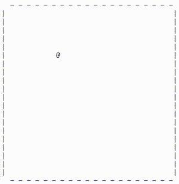

<!-- HEADER -->
<br />
<p align="center">
  <h3 align="center">Intro to Computer Science II</h3>
  <p align="center">
    Programming coursework from Oregon State University CS 162 - Intro to Computer Science II
</p>


<!-- TABLE OF CONTENTS -->
## Table of Contents
* [About the Course](#about-the-course)
* [Getting Started](#getting-started)
* Coursework
 * [Lab 1: Refererence variables for matrix ops](./lab1)
 * [Lab 2: Filestream ops](./lab2)
 * [Lab 3: Functional decomposition, OOP for dice game](./lab3)
 * [Lab 4: Intro to data structures](./lab4)
 * [Lab 5: Recursive functions](./lab5)
 * [Lab 6: Linked lists](./lab6)
 * [Project 1: Langton's ant](./project1)
 * [Project 2: Shopping list program](./project2)
 * [Project 3: OOP for a fantasy RPG](./project3)
 * [Group project: Rock, paper, scissors](./group)
 * [Final project: OOP for a Burning Man RPG](./final)

---
<!-- ABOUT THE Course -->
## About The Course
Basic data structures. Computer programming techniques and application of software engineering principles. Introduction to analysis of programs.

*Langton's ant in action!*



---
<!-- GETTING STARTED -->
## Getting Started
To get a local copy up and running follow these simple steps.


#### Prerequisites
* gcc compiler: https://gcc.gnu.org/install/index.html


#### Usage
1. Clone the repo
```sh
git clone https://github.com/christophrico/Intro-to_CS-II.git
```
2. Compile desired program with make
```sh
make
```
3. Run program, follow prompts
```sh
./prog
```
